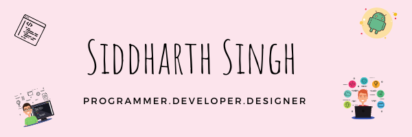
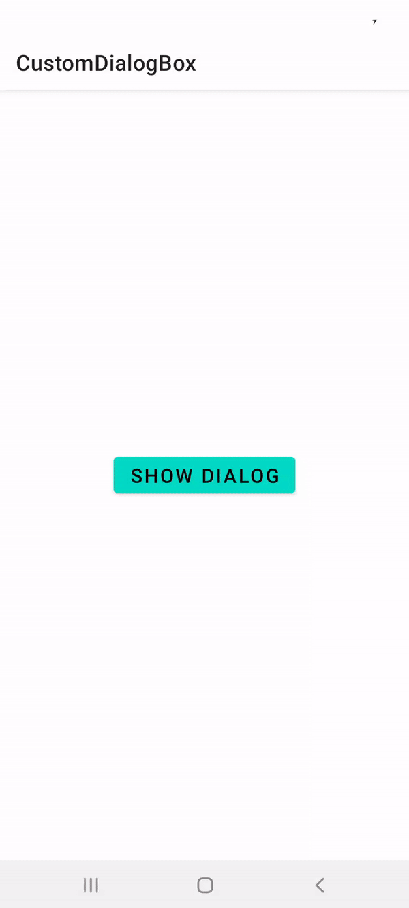

  

<h1 align="center">Hi 👋, I'm Siddharth Singh</h1>
<h3 align="center">A curiosity driven tech-enthusiast who is keen to learn all the development techniques.</h3>

  
  
  
  

  

I am Siddharth Singh, a tech-enthusiast and an avid developer. I am an inquisitive and energetic computer science student full of useful leadership skills and a strong foundation in mathematics, programming and logic. I hope to leverage my solid development skills while focusing on collaboration, passion and creativity into an engineering role that allows me to create engaging projects with beautiful user experience.

<h2 align="left">📝My latest Blogs:</h2>
<a target="_blank" href="https://github-readme-medium-recent-article.vercel.app/medium/@SiddyDevelops/0"> 
 <a target="_blank" href="https://github-readme-medium-recent-article.vercel.app/medium/@SiddyDevelops/1">
 <a target="_blank" href="https://github-readme-medium-recent-article.vercel.app/medium/@SiddyDevelops/1">
   
<h2 align="left">💡Wall of Projects:</h2>

	
	

	 

	
	

   
<h2 align="left">🚀GitHub Stats:</h2>
   

  
<h3 align="left">🛠️Tools and Technologies:</h3>

    
    
     
     
    
    
    
    
    
    
    
    
    
    
    
    
    

